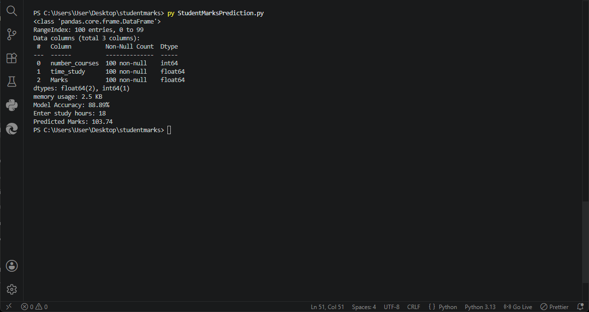
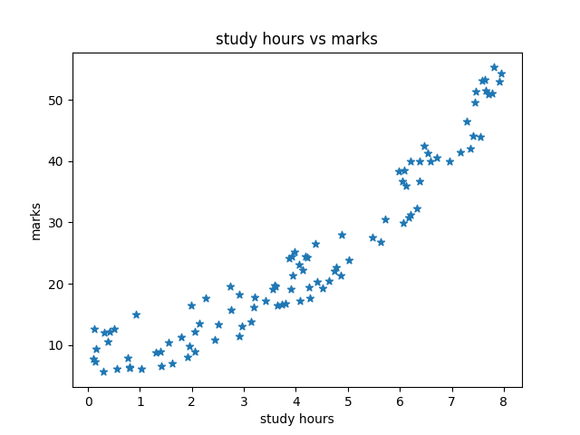

# 📚 Student Marks prediction using Machine learning

This project predicts student marks based on study hours using Linear Regression

# 🚀 technologies used 
 -python
 -numpy
 -pandas
 -matplotlib
 -seaborn
 -scikit-learn

# 🤖 model
 -Linear Regression

# ✨ featres
 - Data preprocessing
 -model training
 -prediction system
 -accuracy evaluation

# 📊 dataset
Student_Marks.csv

# ▶️ How to run--
 # step-1
    -clone the repository
      ```  bash
      git clone 
      ```

 # step-2
    -install required libraries
    ```bash
    pip install numpy pandas matplotlib seaborn scikit-learn
    ```

 # step-3
   - Run the project
   ```bash
   py StudentMarksPrediction.py
   ```

 # 📸 Output Screenshot

   
 
 # 📈 visualisation 
 
   

